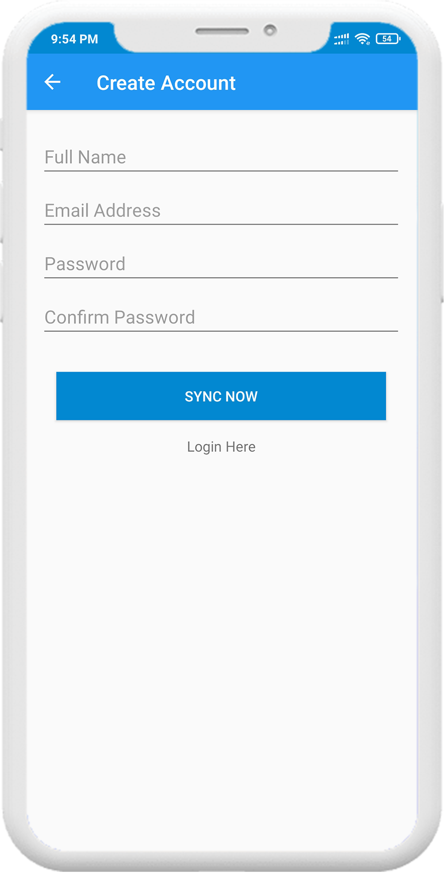
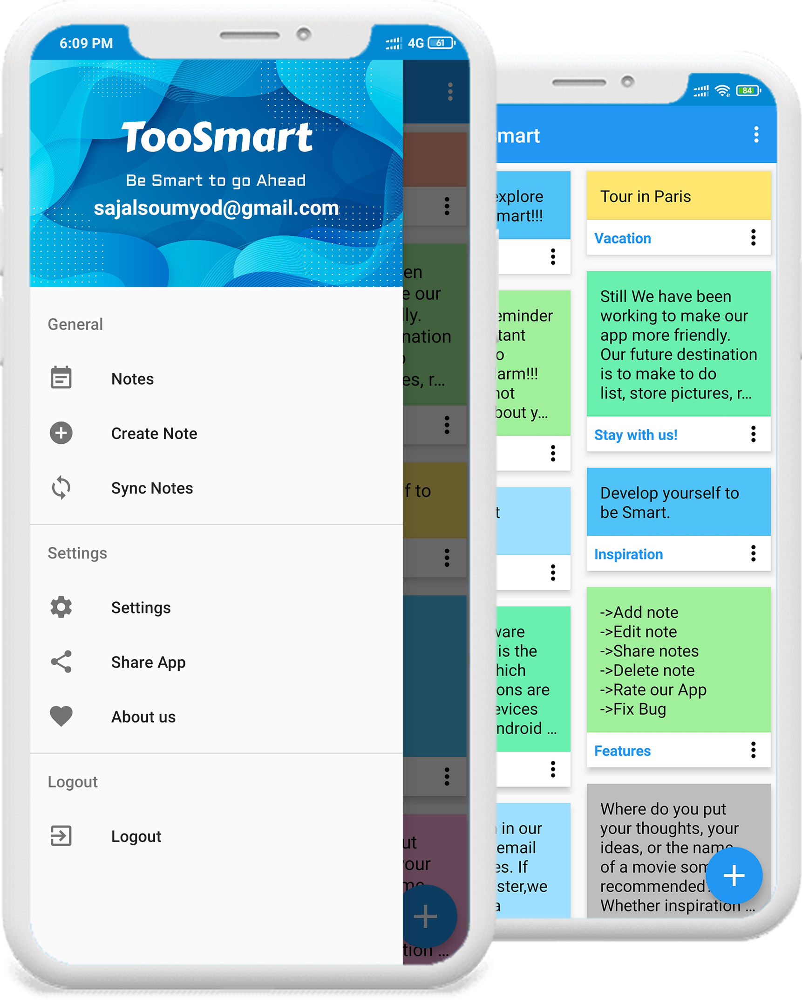

# TooSmartApp
-- A note taking application developed using Java.

**Some Features of the application is given below.**

App View

Register

Login

Menu

Notes

Set Reminder

Settings

## Team - Dynamic DEVs
  * [Shumaiya Akter Shammi](https://github.com/Shammi179) 
  * [Sajal Das](https://github.com/sajaldas19)
  * Md Humayun Farid